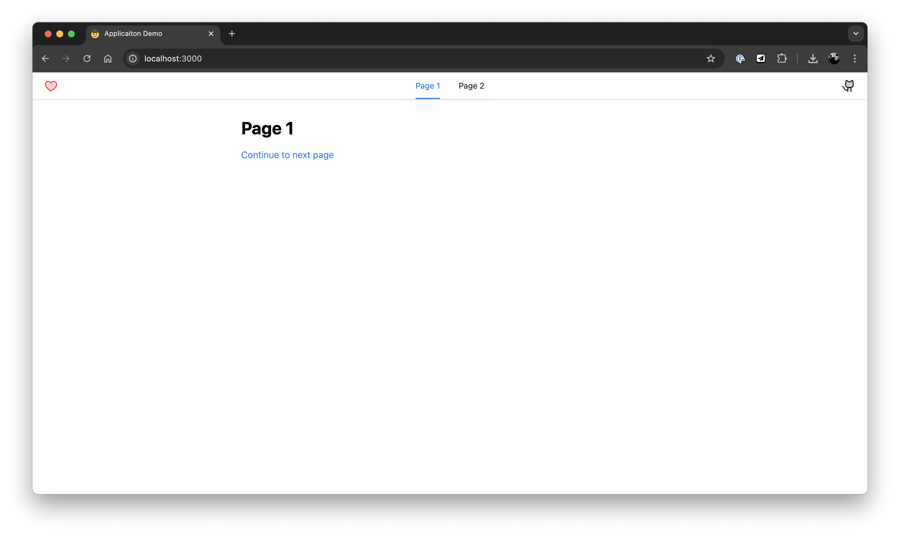

# Prototype Template

This project is meant to serve as a jumping off point for your prototype.

Available:

- [Vite](https://vitejs.dev/guide/)
- [React / TypeScript](https://react.dev/learn/typescript)
- [Routing](https://reactrouter.com/en/main/start/overview)
- [Phosphor Icons](https://phosphoricons.com/)
- [Tailwind](https://tailwindcss.com/docs/installation)
- [Faker](https://fakerjs.dev/api/)
- [Ant Design](https://ant.design/components/overview)
- [Canvas Confetti](https://github.com/catdad/canvas-confetti)

## Before you start

... todo

## Get started

1. If you are wanting to prototype with this template, you will need to choose `Create a new repository` from the `Use this template` option.

2. To begin, install the packages: `npm install`.

3. For local development, run `npm run dev`.

4. You will be asked to enter a password before you can access `Page 1`. The password can be found in the `.env.sample` file. Change the file name to `.env` and set the `VITE_PASSWORD` to a value of your choosing.

5. You may need to stop the server and re-run: `npm run dev`. Checkout [localhost:3000](http://localhost:3000)

To build, run `npm run build`. The output will be in `/dist`

## Deploying a prototype

Include the environment variable `VITE_PASSWORD` to the service that is hosting your prototype. Currently, we deploy to [Vercel](https://vercel.com/home).

## Troubleshooting

... todo
